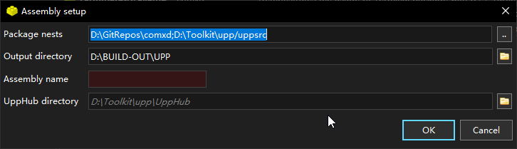

# Requirements

- latest upp
- visual studio 2017 or later \[ optional \]

# How to build

- Install the [upp](https://www.ultimatepp.org/)
- Download the source code
  ```bash
  git clone https://github.com/chivstyle/comxd.git
  git submodule update --init
  ```
- Start the upp IDE, add a new assembly to import comxd
  
- Open the package \"comxd\"
- Build it with your toolchain (VS or CLANG)
