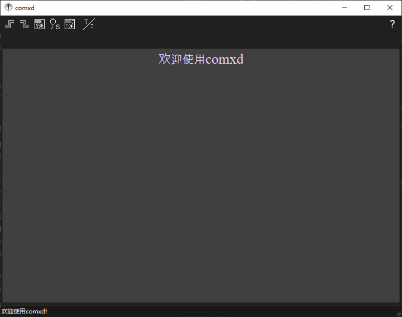
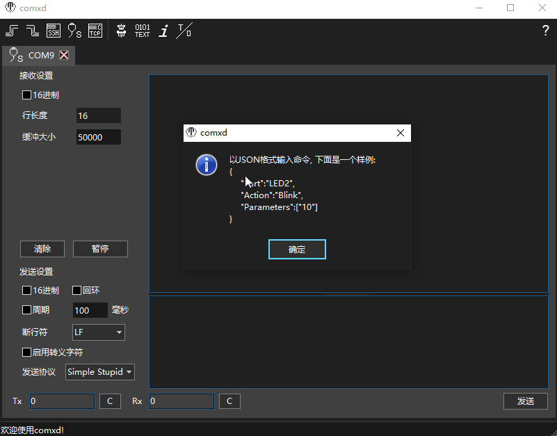

[TOC]

# comxd

Another serial port tool

This is my practice work with [U++](http://www.ultimatepp.org/) at the very beginning.
Now, it helps me a lot, not a toy again. I hope it helps more people.

comxd has a internal virtual terminal as described below. We adopted a versatile [terminal](https://github.com/ismail-yilmaz/Terminal) implementation from v2.2.18.
We'll maintain the internal terminal, but it should be deprecated someday.



comxd was designed for hardware engineers. It supports

- serial port
- SSH
- TCP Client
- Pipe Client [ Windows only ]
- Pipe Server [ Windows only ]

We call these devices as serial I/O, they are popular on smart devices.
Virtual terminal is not the main function of comxd, but "Assistant".


Most of hardware engineers could use it expertly without any help. comxd is a
convinient tool for our engineers, we use it to download firmware, debug communication
protocol, deploy softwares to target board, .etc. I'll show some ocassions to use comxd later.
It's a plesure if this tool helps you.

## Usage

### As a serial device


If you have a vmware station, pipe client will help you.

- Add a serial device

  

- Test it

  ```bash
  sudo bash -c 'echo hello world > /dev/ttyS0'
  ```

  

### Transmit File(s)


## ECMA-48

This is a kind of specification which defines control functions and their coded representations for use in a 7-bit code, an extended 7-bit code, an 8-bit code or an extended 8-bit code.

It says we do not have to support all features defined in ECMA-048. Yes, it's true. If we support all of them, it must be a complicated work I've never experienced.

## vt100

- Features/Sequences were ignored
  
  - Auto wrap. We have unlimited line width, I like it, so we ignore line wrap
  - VT52 control sequences.
  - DECLL
  - DECTST
  - MC
  - Printer. We response "No printer"

- Keys were supported
  
  - Control + ...
  
  - Direction keys
  
  - HOME

## ANSI

- All sequences were recognized
- ANSI Extended charset

## vt220

- charsets

## vt320

- charsets

## vt420

- most of charsets

## vt520

- most of charsets
- All sequences were recognized (well, most of...)
- DCS OSC, .etc were ignored
- We do not process most of sequences

## xterm

- most of charsets
- Ignore a lot of sequences

# Summary

- It's a real compicated work to implent a virtual terminal
- No Sixel，No ReGIS
- Enough for our applications
- Will add more features if we need
